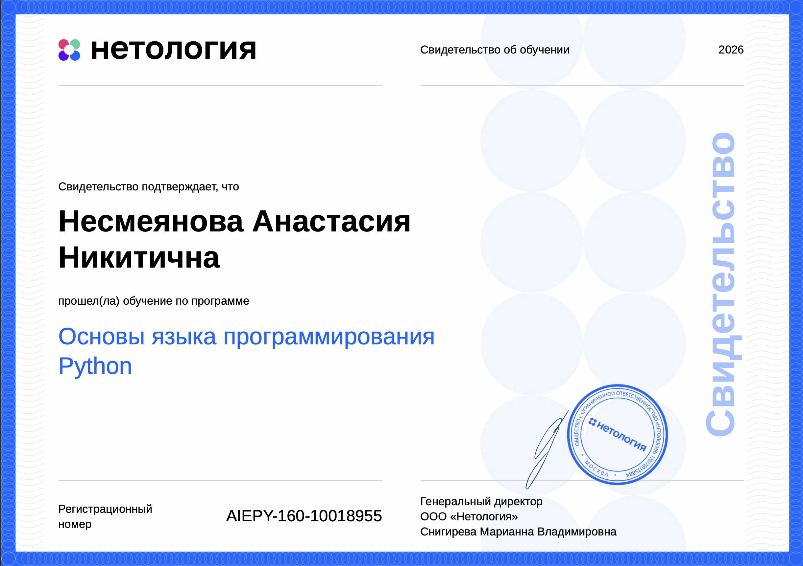

# 🦊 Привет, я Анастасия! (ts-nesmiyana)

Добро пожаловать в мою цифровую лабораторию на MacBook Air M5 Midnight! 🌌🦾 
Я развиваю клиническо-аналитическое мышление, перевожу хаос реального бизнеса в стерильный код на Python и приручаю ИИ в качестве своего личного интерна.

## 🏆 Мои достижения и ИТ-трофеи:

### 🐍 Сертификация по Python (2026)
Официальное свидетельство Нетологии об успешном освоении базы языка Python. Робот-автотестер капитулировал досрочно! 😎🏁

---
*«Код — это просто буквы. Решение проблем — это искусство».* 🥷✨

<!--
**ts-nesmiyana/ts-nesmiyana** is a ✨ _special_ ✨ repository because its `README.md` (this file) appears on your GitHub profile.

Here are some ideas to get you started:

- 🔭 I’m currently working on ...
- 🌱 I’m currently learning ...
- 👯 I’m looking to collaborate on ...
- 🤔 I’m looking for help with ...
- 💬 Ask me about ...
- 📫 How to reach me: ...
- 😄 Pronouns: ...
- ⚡ Fun fact: ...
-->
